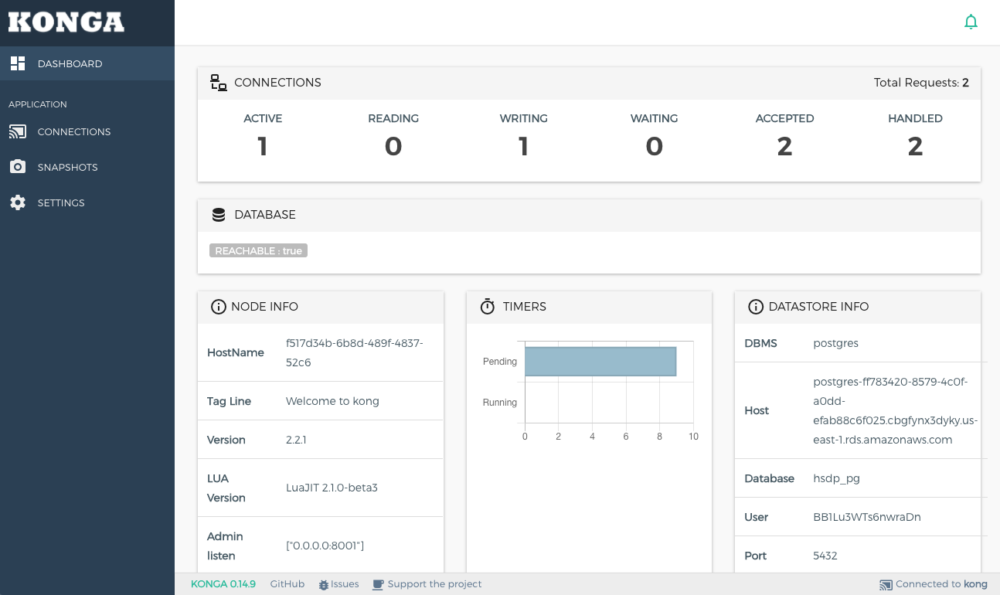

# Kong on HSDP
This Terraform root module demonstrates usage of a Kong API gateway
on HSDP Cloud foundry. We also spin up copy of the Konga UI Dashboard so you can interact with the Kong API gateway using your web browser.

Start by cloning this repo somewhere:

```shell
$ git clone https://github.com/philips-labs/kong-on-hsdp.git
...
$ cd kong-on-hsdp
```

## What is being provisioned

- PostgreSQL database
- Kong API gateway
- Konga Dashboard (internal)
- Kong API Proxy endpoint with generated credentials

## Installing Terraform
Terraform should be installed on your system. [Instructions available here](https://learn.hashicorp.com/tutorials/terraform/install-cli). Once installed check the version, it should be at least `0.14.2` or higher:

```shell
$ terraform version
Terraform v0.14.2
```

## Initalizing Terraform
Next Terraform needs to download the necessary provider plugins, modules and set up the initial (empty) state. Start by executing

```shell
$ terraform init
```

## Configure variables
The default values for this project assume the following:
* You have access to HSDP Cloud foundry HSDP Region `us-east`
* You have `SpaceDeveloper` role to a CF Space

### terraform.tfvars
Create a file called `terraform.tfvars` with the following lines:

```hcl
cf_org      = "my-cf-org"
cf_space    = "test-space"
cf_username = "your_cf_username"
cf_password = "your_cf_password"
```

## terraform plan
Now you are ready to run terraform [plan](https://www.terraform.io/docs/commands/plan.html):

```shell
$ terraform plan
```

Terraform will calculate an execution plan and display all the actions it needs to perform to deploy Kong and all its components.

## terraform apply
The [apply](https://www.terraform.io/docs/commands/apply.html) step will kick off provisioning of all resources:

```shell
$ terraform apply
```

This typically
takes between 5-15 minutes. The majority of the time is spend waiting on the PostgreSQL database to become available for use.
Once the apply step finishes you should see something like below:

```shell
Apply complete! Resources: 15 added, 0 changed, 0 destroyed.

Outputs:

kong_gateway = "https://kong-33483600f6a13c55.us-east.philips-healthsuite.com"
kong_api_username = "33483600f6a13c55"
kong_api_password = "RanomPassw0rdH3re"
kong_api_proxy = "https://kong-api-33483600f6a13c55.us-east.philips-healthsuite.com"
kong_api_internal_endpoint = "http://33483600f6a13c55.apps.internal:8001"
```
## Accessing the Konga dashboard
The [Konga](https://github.com/pantsel/konga) dashboard UI is deployed as part of the module. It does not have a public route by default since there is no authentication mechanism in place. You can port forward the website to your local computer with the following command:

```shell
$ cf ssh -L1337:localhost:1337 konga
```

Once logged in you can navigate to [http://localhost:1337](http://localhost:1337) in your browser. Go to the `CONNECTIONS` section and add a new connection using the value of `kong_api_internal_endpoint` where it asks for the `Kong Admin URL`. Once enter you should
see the Konga dashboard:



# Next steps
* Study the Kong module, fork it and try out some changes
* Explore using the [Kong Terraform Provider](https://registry.terraform.io/providers/philips-labs/kong/latest) to manage Kong configuration
* Join the HSDP Slack `#terraform` channel and share your experience

## terraform destroy
You can remove all created resources using the terraform [destroy](https://www.terraform.io/docs/commands/destroy.html) command

```shell
$ terraform destroy
```
# Contact / Getting help

andy.lo-a-foe@philips.com

# License

License is MIT
